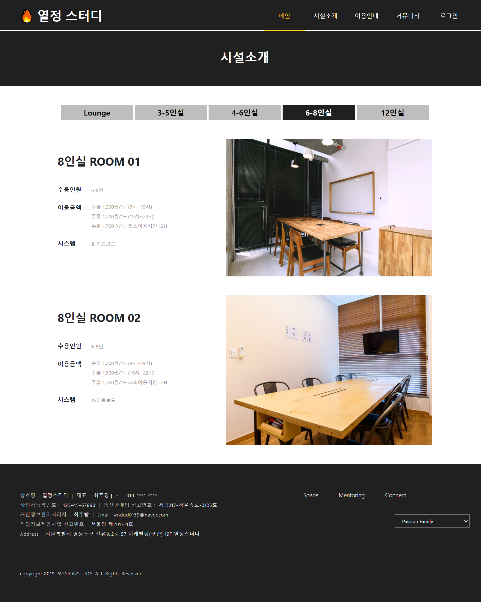

# Passion StudyCafe SemiProject 

`스터디 카페 예약 시스템`

kH 정보교육원 - 디지털 컨버전스기반 융합 응용 SW 개발자 양성과정 '열정조'의 세미 프로젝트로 기획되었으며, `강미선, 김민진, 김종구, 정우혁, 차예진, 최주영, 한아현`으로 구성되어 총 7명이 참가하였습니다.

## 개발환경
#
- OS : Windows 7/10
- Version Control : [GitHub](https://github.com/Ethan-kim9/KH_PassionStudy)
- FW : Servlet / Bootstrap
- Front-end : javascript / jQuery(예정) / AJAX / JSON / HTML5 / CSS3
- Back-end : java8 / MyBatis(예정)
- WAS : Apache Tomcat9.0
- DB : Oracle
- Developer Tools : STS / EclipesEE / VS Code / SqlDeveloper
- 사용 API : kakao API (예정)/ NAVER(네아로)API (예정) 

## 팀원별 맡은 역할 
#
- 강미선 : 마이페이지(프론트,백)
- 김민진 : 커뮤니티(프론트), 공지사항(백)
- 김종구 : 관리자페이지(프론트,백)
- 정우혁 : 메인페이지(프론트), 예약/결제(백)
- 차예진 : 로그인/회원가입(프론트, 백)
- 최주영 : 시설소개, 이용안내(프론트), 1:1문의(백)
- 한아현 : 예약/결제(프론트), 자주하는 질문(백)

## 프로젝트 제작일정
#

## 프로젝트 화면구성도
#

## 프로젝트 ERD
#

## 프로젝트 화면
#

<h2 style="font-weight:bold;">`메인화면`</h2>
 

    
- 사용자에 따른 헤더메뉴 차이
  - 비회원 (메인, 시설소개, 이용안내, 커뮤니티, 로그인)
  - 회원 (메인, 시설소개, 이용안내, 커뮤니티, 예약/결제, 마이페이지, 로그인)
  - 관리자 (메인, 시설소개, 이용안내, 커뮤니티, 예약/결제, 관리자페이지, 로그인)
- INTERIOR 바로가기 클릭 시 시설소개 이동
- SERVICE 바로가기 클릭 시 이용안내 이동 
- 카카오맵 API 구현

 
 

<h2 style="font-weight:bold;">`로그인/회원가입`</h2>
 

 
 

<h2 style="font-weight:bold;">`시설소개`</h2>
 

- lounge, 3-5인실, 4-6인실, 6-8인실, 12인실 룸별로 시설안내
- 각 시설엔 룸명, 수용인원, 이용금액, 시스템 안내가 되어있다.
 
 

<h2 style="font-weight:bold;">`이용안내`</h2>
 

- 시설 이용안내, 스터디룸 이용안내
- 각 이용안내엔 운영시간, 주의사항안내가 되어있다.
 
 

<h2 style="font-weight:bold;">`커뮤니티`</h2>
 

공지사항 이미지
- 회원/비회원 - 공지사항 리스트, 글 상세보기, 검색기능, 페이징처리, 조회수 구현
- 관리자 - 공지사항 리스트, 체크박스로 전체/선택삭제, 글 입력/수정/삭제, 검색기능, 페이징처리, 조회수 구현
 
 

자주하는질문 이미지
- 회원/비회원 - 자주하는질문 리스트, 글 상세보기, 페이징처리 구현
- 관리자 - 자주하는질문 리스트, 체크박스로 전체/선택삭제, 글 입력/수정/삭제, 페이징처리 구현
 
  

1:1문의 이미지
- 회원/비회원 - 1:1문의 리스트, 문의하기 입력/수정/삭제
- 관리자 - 1:1문의 리스트, 체크박스로 전체/선택삭제, 글 수정/삭제, 답변달기 구현
 
 

<h2 style="font-weight:bold;">`예약/결제`</h2>
 

- 룸별로 예약가능
 
 

- JS로 달력구현
- 날짜, 예약시간, 인원, 각 옵션 개수 값 결제하기까지 가져감
 
 

- 전에서 입력한 시간은 예약공간에 예약날짜, 예약인원 예약정보에 나타남
- 회원은 예약자 정보 자동입력 구현
 
 

- 전에서 입력한 예약날짜, 예약시간, 예약인원, 추가옵션 최종 예약 정보에 나타남
- 회원이면 회원이 보유한 포인트 나타남
- 카드결제 선택 시 카드정보 입력 구현
- 무통장입금 선택 시 계좌 안내 후 2시간내로 이체부탁과 주의사항 안내 알림창 구현
- 현장결제 선택 시 메일로 현장결제 안내글 보내줌(미완료)
 
 

<h2 style="font-weight:bold;">`마이페이지`</h2>
 

- 회원 환영글 구현
- 회원이 가지고 있는 포인트와 쿠폰 나타남
 
 

나의 예약 관리 이미지
- 예약 확인, 취소 내역으로 회원이 예약한 상태를 알 수 있음
 
 

- 회원이 1:1 문의를 한 내역 구현
- 관리자가 답변 미완료시 답변대기로 나타나고 완료시 답변완료로 나타남
 
 

- 회원정보 수정 : 이름,이메일(관리자 문의),휴대폰번호 변경 구현
 
 

- 회원정보 수정 : 회원탈퇴하기 구현  
 
 

- 비밀번호 변경 구현
 
 

<h2 style="font-weight:bold;">`관리자페이지`</h2>
 

- 비밀번호 변경 : 관리자가 설정해둔 비밀번호로 변경 구현
- 포인트 변경 : 포인트를 입력해 회원에게 전달 구현
- 회원 쿠폰 설정 : 3000쿠폰 추가, 5000쿠폰 추가, 선택 쿠폰 삭제로 회원에게 쿠폰 전달 구현
- 블랙리스트 설정 : 회원을 블랙리스트로 변경 구현
 
 

매출 조회 이미지
- 월 매출 조회, 기간별 조회로 매출 조회 구현
- 그래프와 표로 나타남
 
 

상품 관리 이미지
- 스터디룸의 정보가 표로 나타남
- 방 상태에 따른 회원이 예약 가능/불가능함
 
 

